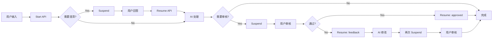

# Workflow 构建完整指南

> **文档版本**: v1.0
> **最后更新**: 2025-01-10
> **基于**: PR Creator 实战经验

## 📖 目录

1. [概述](#概述)
2. [核心概念](#核心概念)
3. [通用架构模式](#通用架构模式)
4. [实施流程](#实施流程)
5. [PR Creator 案例深度分析](#pr-creator-案例深度分析)
6. [可复用组件库](#可复用组件库)
7. [决策指南](#决策指南)
8. [Troubleshooting](#troubleshooting)
9. [FAQ](#faq)

---

## 概述

### 什么是 Workflow？

在本项目中，Workflow 是一种**多步骤的、可暂停恢复的、人机协作的业务流程**，由以下部分组成：

```
┌─────────────────────────────────────────────────────────────┐
│                         Workflow                            │
├─────────────────────────────────────────────────────────────┤
│                                                             │
│  Backend                Frontend               API          │
│  ┌──────────┐          ┌──────────┐         ┌──────────┐   │
│  │  Agent   │          │   UI     │         │  /start  │   │
│  │  +       │  ◄────►  │  State   │  ◄────► │  /resume │   │
│  │ Workflow │          │ Handlers │         └──────────┘   │
│  └──────────┘          └──────────┘                         │
│                                                             │
└─────────────────────────────────────────────────────────────┘
```

### 为什么需要标准化？

基于 PR Creator 的实践，我们发现：

| 问题 | 影响 | 解决方案 |
|------|------|---------|
| 每次都从零开始 | 开发时间 20+ 小时 | 模板化 → 10-15 小时 |
| 架构不一致 | 维护困难，bug 多 | 标准化结构 |
| 重复造轮子 | 代码重复率高 | 提取可复用组件 |
| suspend/resume 易错 | 状态丢失，流程中断 | 最佳实践模式 |

**本指南目标**：将新 Workflow 开发时间缩短 **40-50%**，同时提升质量和可维护性。

---

## 核心概念

### 1. Workflow 生命周期



### 2. Step 类型分类

| 类型 | 特征 | 何时使用 | 示例 |
|------|------|----------|------|
| **Analysis** | • 不 suspend<br>• 返回结构化数据<br>• 使用 structuredOutput | 需要 AI 分析、提取信息 | 分析 Brief、识别缺口 |
| **Clarification** | • **suspend**<br>• 等待用户输入<br>• 可选跳过 | 信息不足，需要补充 | 澄清问题、收集需求 |
| **Generation** | • 不 suspend<br>• 生成内容<br>• 可能耗时较长 | AI 创作核心内容 | 生成稿件、写代码 |
| **Review** | • **suspend**<br>• 等待用户决策<br>• approve/reject | 需要人工审核质量 | 审批稿件、确认方案 |
| **Revision** | • 不 suspend<br>• 基于 feedback<br>• 修改已有内容 | 用户不满意，需修改 | 根据反馈改稿 |
| **Finalize** | • 不 suspend<br>• 组装输出<br>• 清理数据 | 流程最后一步 | 格式化输出 |

### 3. Suspend/Resume 机制

**Suspend**：暂停 Workflow，将状态保存到数据库，返回数据给前端
**Resume**：前端提交数据后，从数据库恢复状态，继续执行

```typescript
// Backend: Suspend
execute: async ({ inputData, resumeData, suspend, suspendData }) => {
  if (resumeData) {
    // Resume 路径：使用 suspendData 恢复上下文
    return {
      savedValue: suspendData?.savedValue,  // 从暂停时保存的数据恢复
      userInput: resumeData,                // 用户新提交的数据
    };
  }

  // Suspend 路径：保存当前状态
  return await suspend({
    savedValue: computedValue,  // 保存到 suspendData
    message: '请提供输入',       // 传给前端显示
  });
}

// Frontend: 处理 Suspend
if (result.suspended) {
  const payload = result.suspendPayload;
  // 显示 UI，收集用户输入
  setMessage(payload.message);
}

// Frontend: Resume
await fetch('/api/workflow/xxx/resume', {
  body: JSON.stringify({
    runId,
    step: 'step-id',
    resumeData: { userInput: '...' },
  }),
});
```

---

## 通用架构模式

### 文件结构标准

```
src/mastra/
├── agents/
│   └── workflow-name-agent.ts         # Agent 定义
├── workflows/
│   ├── CLAUDE.md                       # AI 参考手册（本文档）
│   ├── workflow-name.workflow.ts       # Workflow 编排
│   └── _templates/                     # 模板文件
│       ├── workflow-template.ts
│       └── steps/
│           ├── analysis-step-template.ts
│           ├── review-step-template.ts
│           └── generation-step-template.ts
└── tools/
    └── workflow-name-tools.ts          # 自定义工具（可选）

src/routes/
├── api/workflow/
│   └── workflow-name/
│       ├── start.tsx                   # 启动 API
│       └── resume.tsx                  # 恢复 API
└── agents/ai-workflow/
    ├── _templates/
    │   └── route-template.tsx          # 前端模板
    └── workflow-name/
        ├── route.tsx                   # 前端 UI
        └── CLAUDE.md                   # Workflow 专属文档

docs/5. 研发实施/3. 实施指南/
└── Workflow构建指南.md                 # 本文档
```

### Schema 设计模式

#### 1. Input Schema（用户输入）
```typescript
// 示例：PR Creator
const workflowInputSchema = z.object({
  // 主要业务数据
  brief: briefSchema,
  facts: factsSchema,

  // 输出配置（可选）
  outputConfig: z.object({
    wordCountRange: z.string(),
    languages: z.array(z.string()),
  }).optional(),

  // 补充说明（可选）
  additionalNotes: z.string().optional(),
});

// 设计原则：
// ✅ 扁平化（避免深层嵌套）
// ✅ 可选字段用 .optional()
// ✅ 提供默认值用 .default()
// ✅ 每个字段添加 .describe()
```

#### 2. Step Schemas（步骤间传递）
```typescript
// 每个 Step 需要定义 4 个 Schema
const step = createStep({
  // 输入：从上一步接收的数据
  inputSchema: z.object({
    previousResult: z.string(),
  }),

  // 输出：传给下一步的数据
  outputSchema: z.object({
    processedResult: z.string(),
    metadata: z.object({...}),
  }),

  // Suspend：暂停时传给前端的数据
  suspendSchema: z.object({
    message: z.string(),
    displayData: z.any(),
  }),

  // Resume：前端返回时的数据
  resumeSchema: z.object({
    userInput: z.string(),
    approved: z.boolean(),
  }),
});
```

#### 3. Output Schema（最终输出）
```typescript
// Workflow 的 outputSchema
const workflowOutputSchema = z.object({
  status: z.enum(['approved', 'needs_revision']),
  result: resultSchema,
  metadata: z.object({
    generatedAt: z.string(),
    version: z.number(),
  }),
});
```

### Agent 定义模式

```typescript
// src/mastra/agents/workflow-name-agent.ts
import { Agent } from '@mastra/core/agent';

export const workflowNameAgent = new Agent({
  id: 'workflow-name-agent',
  name: 'Workflow Name Agent',

  // System Prompt（最重要！）
  instructions: `=== 角色定义 ===
你是一位专业的 [领域] 专家。

=== 核心能力 ===
- 能力 1：...
- 能力 2：...

=== 工作原则 ===
- 原则 1：...
- 原则 2：...

=== 输出要求 ===
- 格式：...
- 质量标准：...
`,

  // 选择合适的模型
  model: 'zhipuai/glm-4.7',  // 或 'claude-3-5-sonnet-20241022'

  // 工具（可选）
  tools: {
    // customTool: yourTool,
  },
});
```

**Instructions 编写技巧**：
1. **角色定义**：明确 Agent 的身份和专长
2. **能力列表**：列出具体能力（不要泛泛而谈）
3. **工作原则**：约束行为（如"克制"、"简洁"）
4. **输出要求**：明确格式、长度、风格

### Workflow 组装模式

```typescript
// src/mastra/workflows/workflow-name.workflow.ts
import { createWorkflow, createStep } from '@mastra/core/workflows';
import { z } from 'zod';

// 1. 定义 Schemas
const inputSchema = z.object({...});
const outputSchema = z.object({...});

// 2. 定义 Steps（详见模板）
const step1 = createStep({...});
const step2 = createStep({...});
const step3 = createStep({...});

// 3. 组装 Workflow
export const workflowNameWorkflow = createWorkflow({
  id: 'workflow-name',
  description: '工作流描述',
  inputSchema,
  outputSchema,
})
  .then(step1)
  .then(step2)
  .then(step3)
  .commit();
```

**条件路由示例**（基于 PR Creator）：
```typescript
export const workflow = createWorkflow({...})
  .then(analyzeStep)
  .then(clarifyStep)
  .then(generateStep)
  .then(reviewStep)
  // 条件路由：根据审核结果决定下一步
  .then(async (ctx) => {
    const { approved, feedback } = ctx.output;

    if (approved) {
      // 路径 A：直接完成
      return {
        drafts: ctx.output.drafts,
        primaryLanguage: ctx.output.primaryLanguage,
        approved: true,
      };
    } else {
      // 路径 B：修改 → 再次审核
      const revised = await revisionStep.execute({
        inputData: {
          drafts: ctx.output.drafts,
          feedback,
          originalInput: ctx.run.inputData,
        },
        mastra: ctx.mastra,
        writer: ctx.writer,
      });

      const finalReview = await finalReviewStep.execute({
        inputData: revised,
        suspend: ctx.suspend,
        resumeData: ctx.resumeData,
        suspendData: ctx.suspendData,
      });

      return finalReview;
    }
  })
  .then(finalizeStep)
  .commit();
```

---

## 实施流程

### Phase 1: 需求定义（1-2 小时）

#### 1.1 确定核心目标
**问题清单**：
- [ ] 这个 Workflow 解决什么业务问题？
- [ ] 最终输出是什么？（文档、代码、分析报告等）
- [ ] 目标用户是谁？（技术/非技术用户）

**示例（PR Creator）**：
```
目标：帮助 PR 人员快速创作专业稿件
输出：多语言 PR 稿件（标题、导语、正文等）
用户：PR 专员、市场人员（非技术）
```

#### 1.2 识别步骤类型
使用决策树：

```
开始
  ↓
需要 AI 分析输入吗？ ──Yes→ Analysis Step
  ↓ No
信息是否完整？ ──No→ Clarification Step
  ↓ Yes
需要 AI 生成内容吗？ ──Yes→ Generation Step
  ↓ No
需要人工审核吗？ ──Yes→ Review Step
  ↓ No
需要基于反馈修改吗？ ──Yes→ Revision Step + Final Review Step
  ↓ No
Finalize Step
```

**PR Creator 示例**：
```
analyzeBriefStep (Analysis)
    ↓
clarifyQuestionsStep (Clarification)
    ↓
generateDraftStep (Generation)
    ↓
humanReviewStep (Review)
    ↓
[Conditional] → reviseDraftStep (Revision)
                    ↓
                humanReviewFinalStep (Final Review)
    ↓
finalizeStep (Finalize)
```

#### 1.3 设计数据流
画出数据流图：

```
Input
  ↓
[ Step 1: Analysis ]
  ↓ analysis + originalInput
[ Step 2: Clarification ]
  ↓ analysis + clarifications
[ Step 3: Generation ]
  ↓ drafts + metadata
[ Step 4: Review ]
  ↓ drafts + approved + feedback
[ Conditional Router ]
  ├─ approved? → Finalize
  └─ rejected? → Revision → Final Review → Finalize
```

### Phase 2: Schema 设计（2-3 小时）

#### 2.1 Input Schema
```typescript
// 从用户角度思考：他们会提供什么？
const workflowInputSchema = z.object({
  // 核心业务数据（必填）
  mainData: mainDataSchema,

  // 配置选项（可选）
  config: z.object({
    option1: z.string(),
    option2: z.number(),
  }).optional().default({
    option1: 'default',
    option2: 100,
  }),

  // 补充说明（可选）
  notes: z.string().optional(),
});
```

#### 2.2 Step Schemas
为每个 Step 设计 input/output：

```typescript
// Step 1: Analysis
// Input: workflowInput
// Output: { analysis, originalInput }

// Step 2: Clarification (suspend)
// Input: { analysis, originalInput }
// Output: { analysis, originalInput, clarifications }
// Suspend: { message, questions }
// Resume: { answers }

// Step 3: Generation
// Input: { analysis, clarifications }
// Output: { result }
```

#### 2.3 验证 Schema 一致性
**检查清单**：
- [ ] Step N 的 outputSchema 是否匹配 Step N+1 的 inputSchema？
- [ ] suspendSchema 的数据是否足够前端渲染 UI？
- [ ] resumeSchema 是否包含所有前端可能返回的数据？

### Phase 3: Agent 创建（1-2 小时）

#### 3.1 编写 Instructions
使用 PR Creator 的结构：

```typescript
instructions: `=== [一级标题：角色] ===
[2-3 句话定义角色身份和特点]

=== [二级标题：能力/原则/风格] ===
- [具体描述 1]
- [具体描述 2]
- [具体描述 3]

=== [约束条件] ===
- 必须/禁止做什么
`
```

#### 3.2 选择模型
| 模型 | 上下文 | 适用场景 |
|------|--------|---------|
| GLM-4.7 | 205K | • 中文优先<br>• 成本敏感<br>• 需要大上下文 |
| Claude Sonnet | 200K | • 英文优先<br>• 复杂推理<br>• 高质量输出 |
| GPT-4 | 128K | • 兼容性要求高 |

#### 3.3 测试 Agent
```typescript
// 快速测试脚本
import { mastra } from '~/mastra';

const agent = mastra.getAgent('your-agent');
const response = await agent.generate('测试 prompt', {
  structuredOutput: {
    schema: testSchema,
    jsonPromptInjection: true,
  },
});

console.log(response.object);
```

### Phase 4: Workflow 实现（4-6 小时）

#### 4.1 使用模板创建 Steps
参考 `src/mastra/workflows/_templates/steps/` 中的模板文件。

#### 4.2 实现进度通知（可选但推荐）
```typescript
// 在耗时步骤中添加
await writer?.custom({
  type: 'progress',
  data: {
    status: 'in-progress',
    message: '正在处理第 2/5 步...',
    current: 2,
    total: 5,
  },
});
```

#### 4.3 添加错误处理
```typescript
execute: async ({ inputData, mastra }) => {
  try {
    const response = await agent.generate(...);
    return response.object!;
  } catch (error) {
    console.error(`[workflow:step-id] Error:`, error);

    // 使用 fallback
    return fallbackValue;

    // 或抛出错误（会中断 workflow）
    // throw new Error('处理失败');
  }
}
```

### Phase 5: API 端点（1 小时）

#### 5.1 创建 start.tsx
```typescript
// src/routes/api/workflow/your-workflow/start.tsx
import { createFileRoute } from '@tanstack/react-router';
import { json } from '@tanstack/start';
import { z } from 'zod';
import { mastra } from '~/mastra';

export const Route = createFileRoute('/api/workflow/your-workflow/start')({
  server: {
    handlers: {
      POST: async ({ request }) => {
        try {
          const input = await request.json();

          const result = await mastra.workflows.yourWorkflow.execute({
            input,
          });

          return json({
            runId: result.runId,
            status: result.status,
            suspended: result.suspended,
            suspendPayload: result.suspendPayload,
            result: result.result,
          });
        } catch (error) {
          console.error('[start] Error:', error);
          return json(
            { error: error.message },
            { status: 500 }
          );
        }
      },
    },
  },
});
```

#### 5.2 创建 resume.tsx
```typescript
// src/routes/api/workflow/your-workflow/resume.tsx
import { createFileRoute } from '@tanstack/react-router';
import { json } from '@tanstack/start';
import { mastra } from '~/mastra';

export const Route = createFileRoute('/api/workflow/your-workflow/resume')({
  server: {
    handlers: {
      POST: async ({ request }) => {
        try {
          const { runId, step, resumeData } = await request.json();

          const result = await mastra.workflows.yourWorkflow.resume({
            runId,
            step,
            resumeData,
          });

          return json({
            runId: result.runId,
            status: result.status,
            suspended: result.suspended,
            suspendedStep: result.suspended?.[0],
            suspendPayload: result.suspendPayload,
            steps: result.steps,
            result: result.result,
          });
        } catch (error) {
          console.error('[resume] Error:', error);
          return json(
            { error: error.message },
            { status: 500 }
          );
        }
      },
    },
  },
});
```

### Phase 6: 前端实现（8-12 小时）

参考 `src/routes/agents/ai-workflow/_templates/route-template.tsx`。

#### 6.1 状态管理
```typescript
function WorkflowComponent() {
  // 流程控制
  const [currentStep, setCurrentStep] = useState<WorkflowStep>('input');
  const [runId, setRunId] = useState<string | null>(null);
  const [error, setError] = useState<string | null>(null);

  // 业务数据
  const [inputData, setInputData] = useState<InputType>({...});
  const [result, setResult] = useState<ResultType | null>(null);
}
```

#### 6.2 API 调用
```typescript
const handleStart = useCallback(async () => {
  setCurrentStep('processing');
  setError(null);

  try {
    const response = await fetch('/api/workflow/your-workflow/start', {
      method: 'POST',
      headers: { 'Content-Type': 'application/json' },
      body: JSON.stringify(inputData),
    });

    const result = await response.json();

    if (!response.ok) {
      throw new Error(result.error || '启动失败');
    }

    setRunId(result.runId);

    // 处理 suspend
    if (result.suspended) {
      handleSuspended(result);
    } else if (result.status === 'success') {
      setCurrentStep('done');
      setResult(result.result);
    }
  } catch (err) {
    setError(err.message);
    setCurrentStep('input');
  }
}, [inputData]);
```

#### 6.3 处理 Suspend
```typescript
const handleSuspended = (result: WorkflowResult) => {
  // 解析 suspended 数组
  const suspendedEntry = result.suspended?.[0];
  let stepId: string;

  if (typeof suspendedEntry === 'string') {
    stepId = suspendedEntry;
  } else if (Array.isArray(suspendedEntry)) {
    stepId = suspendedEntry[suspendedEntry.length - 1];
  } else {
    console.error('Unexpected suspended format');
    return;
  }

  const suspendPayload = result.steps?.[stepId]?.suspendPayload;

  // 根据 stepId 决定显示哪个 UI
  if (stepId === 'clarify-questions') {
    setQuestions(suspendPayload.questions);
    setCurrentStep('clarify');
  } else if (stepId === 'human-review') {
    setDraft(suspendPayload.draft);
    setCurrentStep('review');
  }
};
```

#### 6.4 UI 组件
```tsx
<div className="flex h-full flex-col gap-6">
  {/* Header */}
  <Header />

  {/* Progress */}
  <StepIndicator currentStep={currentStep} />

  {/* Error */}
  {error && <ErrorAlert>{error}</ErrorAlert>}

  {/* Content */}
  <div className="flex-1 overflow-auto">
    {currentStep === 'input' && <InputStep {...} />}
    {currentStep === 'processing' && <LoadingStep message="..." />}
    {currentStep === 'review' && <ReviewStep {...} />}
    {currentStep === 'done' && <DoneStep {...} />}
  </div>
</div>
```

### Phase 7: 测试与优化（2-4 小时）

#### 7.1 测试清单
- [ ] 正常流程（所有步骤都成功）
- [ ] 跳过 Clarification（canSkip = true）
- [ ] 审核拒绝 → 修改流程
- [ ] 错误处理（API 失败、超时）
- [ ] 边界情况（空输入、极长输入）

#### 7.2 Prompt 优化
通过测试结果迭代优化 Prompt：
- 如果输出格式错误 → 强化 JSON 示例
- 如果输出质量低 → 调整 instructions
- 如果经常超时 → 简化任务或拆分步骤

#### 7.3 性能优化
- [ ] 并行执行独立步骤
- [ ] 添加缓存（如分析结果）
- [ ] 使用 writer.custom() 提供进度反馈

---

## PR Creator 案例深度分析

### 架构概览

```
PR Creator Workflow
├── Backend (Mastra)
│   ├── Agent: pr-writer-agent (GLM-4.7)
│   └── Workflow: 7 Steps
│       ├── analyzeBriefStep (Analysis)
│       ├── clarifyQuestionsStep (Clarification, suspend)
│       ├── generateDraftStep (Generation, 多语言)
│       ├── humanReviewStep (Review, suspend)
│       ├── [Conditional Router]
│       ├── reviseDraftStep (Revision)
│       ├── humanReviewFinalStep (Final Review, suspend)
│       └── finalizeStep (Finalize)
│
├── API
│   ├── /api/workflow/pr-creator/start
│   └── /api/workflow/pr-creator/resume
│
└── Frontend (TanStack Start + React)
    ├── State Management (10+ useState)
    ├── UI Components (8 个)
    └── API Handlers (4 个)
```

### 关键创新点

#### 1. 多语言批量生成
**问题**：用户希望一次生成多个语言版本（最多 3 种）

**解决方案**：
```typescript
// Backend: generateDraftStep
const drafts: PRDraft[] = [];
const primaryLanguage = outputConfig.languages[0];

for (let i = 0; i < outputConfig.languages.length; i++) {
  const langCode = outputConfig.languages[i];
  const isFirstLanguage = i === 0;

  if (isFirstLanguage) {
    // 第一种语言：完整生成
    prompt = `请用 ${langName} 撰写...`;
  } else {
    // 其他语言：基于主语言翻译改编
    const primaryDraft = drafts[0];
    prompt = `请将以下稿件翻译/改编为 ${langName}...`;
  }

  const response = await agent.generate(prompt, {...});
  drafts.push({ ...response.object!, language: langCode });
}

return { drafts, primaryLanguage };
```

**Frontend: Tab 切换 UI**
```tsx
<Tabs value={selectedLanguage} onValueChange={setSelectedLanguage}>
  <TabsList>
    {drafts.map((draft) => (
      <TabsTrigger key={draft.language} value={draft.language}>
        {langFlag} {langName}
      </TabsTrigger>
    ))}
  </TabsList>
  {drafts.map((draft) => (
    <TabsContent key={draft.language} value={draft.language}>
      <DraftPreview draft={draft} />
    </TabsContent>
  ))}
</Tabs>
```

**可复用性**：这个模式可用于任何需要多语言/多版本输出的 Workflow。

#### 2. Revision Workflow（条件路由）
**问题**：用户审核不通过时，希望 AI 根据反馈修改

**解决方案**：使用条件路由
```typescript
.then(humanReviewStep)
.then(async (ctx) => {
  const { approved, feedback } = ctx.output;

  if (approved) {
    // 直接完成
    return { drafts: ctx.output.drafts, approved: true };
  } else {
    // 执行修改 → 再次审核
    const revised = await reviseDraftStep.execute({...});
    const finalReview = await humanReviewFinalStep.execute({...});
    return finalReview;
  }
})
.then(finalizeStep)
```

**Frontend: Feedback 表单**
```tsx
const [showFeedbackForm, setShowFeedbackForm] = useState(false);
const [feedback, setFeedback] = useState('');

{showFeedbackForm && (
  <Card>
    <CardHeader>
      <CardTitle>修改意见</CardTitle>
    </CardHeader>
    <CardContent>
      <Textarea
        value={feedback}
        onChange={(e) => setFeedback(e.target.value)}
        placeholder="请提供修改建议..."
      />
      <Button onClick={() => onReject(feedback)}>
        提交反馈，重新生成
      </Button>
    </CardContent>
  </Card>
)}
```

**可复用性**：任何需要"审核 → 修改 → 再审核"循环的 Workflow 都可使用。

#### 3. 动态字数约束
**问题**：不同场景需要不同字数范围（500-800 / 800-1200 / ...）

**解决方案**：
```typescript
// Frontend: 让用户选择
const WORD_COUNT_OPTIONS = [
  { value: '500-800', label: '500-800 字（简短）' },
  { value: '800-1200', label: '800-1200 字（标准）' },
  { value: '1200-1800', label: '1200-1800 字（详细）' },
  { value: '1800-2500', label: '1800-2500 字（深度）' },
];

// Backend: 动态插入 Prompt
const [minWords, maxWords] = outputConfig.wordCountRange.split('-').map(Number);

const prompt = `
## 写作要求
- **字数要求**: 正文必须在 ${minWords}-${maxWords} 字之间
  - 不得少于 ${minWords} 字
  - 不得超过 ${maxWords} 字
`;
```

**注意**：同时需要修改 Agent instructions，移除固定字数约束。

#### 4. 进度通知
**问题**：多语言生成耗时长，用户不知道进度

**解决方案**：
```typescript
// Backend: 在循环中发送进度
for (let i = 0; i < languages.length; i++) {
  await writer?.custom({
    type: 'progress',
    data: {
      status: 'in-progress',
      message: `正在生成 ${langName} 版本... (${i + 1}/${languages.length})`,
      current: i + 1,
      total: languages.length,
    },
  });

  // 生成逻辑...
}
```

**Frontend: 监听进度事件**（如使用 SSE）
```typescript
// TODO: 当前版本暂未实现前端进度监听
// 未来可通过 SSE 或 WebSocket 实时显示进度
```

### 数据流详解

```
Input
├── brief: { client, project, objective, ... }
├── facts: { rawContent }
└── outputConfig: { wordCountRange, languages }
  ↓
analyzeBriefStep
├── Input: { brief, facts, outputConfig }
└── Output: { analysis, originalInput }
  ↓
clarifyQuestionsStep (suspend)
├── Input: { analysis, originalInput }
├── Suspend: { message, questions, canSkip }
├── Resume: { answers, skipClarification }
└── Output: { analysis, originalInput, clarifications }
  ↓
generateDraftStep
├── Input: { analysis, originalInput, clarifications }
└── Output: { drafts[], primaryLanguage, originalInput }
  ↓
humanReviewStep (suspend)
├── Input: { drafts, primaryLanguage }
├── Suspend: { message, drafts, primaryLanguage }
├── Resume: { approved, feedback }
└── Output: { drafts, primaryLanguage, approved, feedback }
  ↓
[Conditional Router]
├─ if approved → { drafts, approved: true }
└─ if !approved
      ↓
   reviseDraftStep
   ├── Input: { drafts, feedback, originalInput }
   └── Output: { drafts, primaryLanguage }
      ↓
   humanReviewFinalStep (suspend)
   ├── Suspend: { message, drafts }
   ├── Resume: { approved }
   └── Output: { drafts, primaryLanguage, approved }
  ↓
finalizeStep
├── Input: { drafts, primaryLanguage, approved }
└── Output: { status, drafts, fullTexts }
```

### 技术难点与解决方案

#### 难点 1: GLM 模型的 JSON 输出不稳定
**表现**：有时返回 Markdown 包裹的 JSON，有时包含额外文字

**解决方案**：
```typescript
// 1. 使用 jsonPromptInjection
structuredOutput: {
  schema: yourSchema,
  jsonPromptInjection: true,  // 关键！
  errorStrategy: 'fallback',
  fallbackValue: {...},
}

// 2. 在 Prompt 中强化要求
const prompt = `
请严格按以下 JSON 格式输出（只输出 JSON，不要其他内容）：
${JSON.stringify(exampleOutput)}
`;
```

#### 难点 2: Frontend 数据结构不匹配
**表现**：Backend 返回 `drafts` 数组，Frontend 期望 `draft` 对象

**解决方案**：
```typescript
// Backend: 统一返回数组
suspendPayload: {
  drafts: [...],  // 总是数组
  primaryLanguage: 'zh',
}

// Frontend: 统一处理数组
const drafts = result.suspendPayload?.drafts;
if (drafts && drafts.length > 0) {
  setDrafts(drafts);
  setDraft(drafts[0]);  // 兼容旧代码
}
```

#### 难点 3: 多次 Resume 的状态管理
**表现**：`humanReviewStep` 和 `humanReviewFinalStep` 都可能被 resume

**解决方案**：
```typescript
// Frontend: 自动检测当前在哪个 step
const handleApprove = async () => {
  let stepId = 'human-review';  // 默认尝试

  const response = await fetch('/api/workflow/pr-creator/resume', {
    body: JSON.stringify({ runId, step: stepId, resumeData: { approved: true } }),
  });

  const result = await response.json();

  if (!response.ok && result.error.includes('Step not suspended')) {
    // 尝试 human-review-final
    const finalResponse = await fetch('/api/workflow/pr-creator/resume', {
      body: JSON.stringify({
        runId,
        step: 'human-review-final',
        resumeData: { approved: true },
      }),
    });
    // 处理结果...
  }
};
```

---

## 可复用组件库

### React 组件（建议位置：`src/components/workflow/`）

#### 1. WorkflowStepIndicator
```typescript
// src/components/workflow/StepIndicator.tsx
import { LucideIcon } from 'lucide-react';

interface Step {
  id: string;
  label: string;
  icon: LucideIcon;
}

interface StepIndicatorProps {
  steps: Step[];
  currentStep: string;
  getStepStatus?: (stepId: string) => 'pending' | 'current' | 'completed';
}

export function StepIndicator({ steps, currentStep, getStepStatus }: StepIndicatorProps) {
  const defaultGetStepStatus = (stepId: string) => {
    const currentIndex = steps.findIndex((s) => s.id === currentStep);
    const stepIndex = steps.findIndex((s) => s.id === stepId);

    if (stepIndex < currentIndex) return 'completed';
    if (stepIndex === currentIndex) return 'current';
    return 'pending';
  };

  const statusGetter = getStepStatus || defaultGetStepStatus;

  return (
    <div className="flex items-center justify-center gap-2">
      {steps.map((step, index) => {
        const status = statusGetter(step.id);
        const Icon = step.icon;

        return (
          <div key={step.id} className="flex items-center">
            <div
              className={cn(
                'flex items-center gap-2 rounded-full px-4 py-2 text-sm font-medium',
                status === 'current' && 'bg-primary text-primary-foreground',
                status === 'completed' && 'bg-green-100 text-green-700',
                status === 'pending' && 'bg-muted text-muted-foreground'
              )}
            >
              <Icon className="h-4 w-4" />
              {step.label}
            </div>
            {index < steps.length - 1 && (
              <ArrowRight className="mx-2 h-4 w-4 text-muted-foreground" />
            )}
          </div>
        );
      })}
    </div>
  );
}
```

#### 2. WorkflowLoadingStep
```typescript
// src/components/workflow/LoadingStep.tsx
interface LoadingStepProps {
  message: string;
  progress?: number;  // 0-100
}

export function LoadingStep({ message, progress }: LoadingStepProps) {
  return (
    <div className="flex h-full flex-col items-center justify-center gap-4">
      <Loader2 className="h-8 w-8 animate-spin text-primary" />
      <p className="text-muted-foreground">{message}</p>
      {progress !== undefined && (
        <div className="w-64">
          <div className="h-2 w-full rounded-full bg-muted">
            <div
              className="h-2 rounded-full bg-primary transition-all"
              style={{ width: `${progress}%` }}
            />
          </div>
          <p className="mt-2 text-center text-sm text-muted-foreground">
            {progress}%
          </p>
        </div>
      )}
    </div>
  );
}
```

#### 3. WorkflowErrorAlert
```typescript
// src/components/workflow/ErrorAlert.tsx
interface ErrorAlertProps {
  error: string;
  onRetry?: () => void;
}

export function ErrorAlert({ error, onRetry }: ErrorAlertProps) {
  return (
    <Alert variant="destructive">
      <AlertCircle className="h-4 w-4" />
      <AlertDescription className="flex items-center justify-between">
        <span>{error}</span>
        {onRetry && (
          <Button variant="outline" size="sm" onClick={onRetry}>
            重试
          </Button>
        )}
      </AlertDescription>
    </Alert>
  );
}
```

### React Hooks（建议位置：`src/hooks/workflow/`）

#### useWorkflow
```typescript
// src/hooks/workflow/useWorkflow.ts
interface WorkflowState<I, O> {
  step: string;
  runId: string | null;
  error: string | null;
  result: O | null;
}

export function useWorkflow<I, O>(workflowId: string) {
  const [state, setState] = useState<WorkflowState<I, O>>({
    step: 'input',
    runId: null,
    error: null,
    result: null,
  });

  const start = async (input: I) => {
    setState((prev) => ({ ...prev, step: 'processing', error: null }));

    try {
      const response = await fetch(`/api/workflow/${workflowId}/start`, {
        method: 'POST',
        headers: { 'Content-Type': 'application/json' },
        body: JSON.stringify(input),
      });

      const result = await response.json();

      if (!response.ok) {
        throw new Error(result.error || '启动失败');
      }

      setState((prev) => ({ ...prev, runId: result.runId }));

      return result;
    } catch (error) {
      setState((prev) => ({
        ...prev,
        error: error.message,
        step: 'input',
      }));
      throw error;
    }
  };

  const resume = async (step: string, resumeData: any) => {
    setState((prev) => ({ ...prev, step: 'processing', error: null }));

    try {
      const response = await fetch(`/api/workflow/${workflowId}/resume`, {
        method: 'POST',
        headers: { 'Content-Type': 'application/json' },
        body: JSON.stringify({
          runId: state.runId,
          step,
          resumeData,
        }),
      });

      const result = await response.json();

      if (!response.ok) {
        throw new Error(result.error || '恢复失败');
      }

      return result;
    } catch (error) {
      setState((prev) => ({ ...prev, error: error.message }));
      throw error;
    }
  };

  const reset = () => {
    setState({
      step: 'input',
      runId: null,
      error: null,
      result: null,
    });
  };

  return { state, start, resume, reset };
}
```

#### useWorkflowSuspend
```typescript
// src/hooks/workflow/useWorkflowSuspend.ts
export function useWorkflowSuspend() {
  const parseSuspended = (result: any) => {
    if (!result.suspended || result.suspended.length === 0) {
      return null;
    }

    const suspendedEntry = result.suspended[0];
    let stepId: string;

    if (typeof suspendedEntry === 'string') {
      stepId = suspendedEntry;
    } else if (Array.isArray(suspendedEntry)) {
      stepId = suspendedEntry[suspendedEntry.length - 1];
    } else {
      throw new Error('Unexpected suspended format');
    }

    const suspendPayload = result.steps?.[stepId]?.suspendPayload;

    return { stepId, suspendPayload };
  };

  return { parseSuspended };
}
```

### Workflow Step 工厂函数

#### createAnalysisStep
```typescript
// src/mastra/workflows/utils/createAnalysisStep.ts
import { createStep } from '@mastra/core/workflows';
import { ZodSchema } from 'zod';

interface AnalysisStepConfig {
  id: string;
  description: string;
  agentId: string;
  inputSchema: ZodSchema;
  outputSchema: ZodSchema;
  buildPrompt: (input: any) => string;
}

export function createAnalysisStep(config: AnalysisStepConfig) {
  return createStep({
    id: config.id,
    description: config.description,
    inputSchema: config.inputSchema,
    outputSchema: config.outputSchema,
    execute: async ({ inputData, mastra }) => {
      const agent = mastra?.getAgent(config.agentId);

      if (!agent) {
        throw new Error(`Agent ${config.agentId} not found`);
      }

      const prompt = config.buildPrompt(inputData);

      const response = await agent.generate(prompt, {
        structuredOutput: {
          schema: config.outputSchema,
          jsonPromptInjection: true,
          errorStrategy: 'fallback',
          fallbackValue: {},
        },
      });

      return response.object!;
    },
  });
}

// 使用示例
const analyzeStep = createAnalysisStep({
  id: 'analyze-brief',
  description: '分析用户输入',
  agentId: 'pr-writer-agent',
  inputSchema: workflowInputSchema,
  outputSchema: analysisResultSchema,
  buildPrompt: (input) => `请分析：${JSON.stringify(input)}`,
});
```

---

## 决策指南

### 何时使用 Suspend？

| 场景 | 是否 Suspend | 原因 |
|------|--------------|------|
| 需要用户提供额外信息 | ✅ Yes | Clarification Step |
| 需要用户审核/决策 | ✅ Yes | Review Step |
| AI 自动分析 | ❌ No | Analysis Step |
| AI 生成内容 | ❌ No | Generation Step |
| 基于规则的路由 | ❌ No | 使用 Conditional Router |

### 何时使用 Conditional Routing？

**适用场景**：
- 根据用户决策（approve/reject）选择不同路径
- 根据数据特征（如：文件大小）选择不同处理方式
- 实现循环逻辑（如：修改 → 审核 → 通过/再修改）

**不适用场景**：
- 简单的线性流程
- 所有分支最终合并到同一步骤

### 选择模型的决策树

```
开始
  ↓
是否需要大上下文（> 128K）？
  ├─ Yes → GLM-4.7 (205K) 或 Claude Sonnet (200K)
  └─ No → 继续
           ↓
         是否中文为主？
           ├─ Yes → GLM-4.7
           └─ No → 继续
                    ↓
                  是否需要复杂推理？
                    ├─ Yes → Claude Sonnet
                    └─ No → GLM-4.7 (成本更低)
```

### 设计 Prompt 的策略

#### 策略 1: 分层结构
```
## 一级：任务定义
请完成 XX 任务

## 二级：输入数据
以下是输入：
${data}

## 三级：输出要求
请按以下格式输出：
${schema}

## 四级：约束条件
注意：
- 必须...
- 禁止...
```

#### 策略 2: Few-Shot Learning
```typescript
const prompt = `
请分析以下文本：

示例 1:
输入: ...
输出: { analysis: "...", score: 8 }

示例 2:
输入: ...
输出: { analysis: "...", score: 6 }

现在请分析：
输入: ${actualInput}
输出:
`;
```

#### 策略 3: Chain-of-Thought
```typescript
const prompt = `
请按以下步骤分析：

1. 首先，识别关键信息
2. 然后，评估质量
3. 最后，给出建议

请逐步思考并输出最终结果。
`;
```

---

## Troubleshooting

### 问题 1: GLM 模型返回非 JSON
**症状**：`response.object` 为 `undefined`，`response.text` 包含 Markdown

**原因**：GLM 不支持原生 `response_format`

**解决方案**：
```typescript
// ✅ 正确
structuredOutput: {
  schema: yourSchema,
  jsonPromptInjection: true,  // 必须！
  errorStrategy: 'fallback',
}

// ❌ 错误
structuredOutput: {
  schema: yourSchema,
  // 缺少 jsonPromptInjection
}
```

### 问题 2: Resume 后数据丢失
**症状**：Resume 后，之前的数据（如 `originalInput`）丢失

**原因**：没有使用 `suspendData` 恢复上下文

**解决方案**：
```typescript
// ✅ 正确
execute: async ({ inputData, resumeData, suspend, suspendData }) => {
  if (resumeData) {
    // 从 suspendData 恢复
    const savedContext = suspendData?.originalInput || inputData.originalInput;
    return {
      originalInput: savedContext,
      userInput: resumeData,
    };
  }

  // Suspend 时保存上下文
  return await suspend({
    originalInput: inputData.originalInput,
    message: '...',
  });
}
```

### 问题 3: Frontend 无法正确解析 suspended
**症状**：`suspendPayload` 为 `undefined`

**原因**：`suspended` 数组可能嵌套

**解决方案**：
```typescript
// ✅ 正确
const suspendedEntry = result.suspended?.[0];
let stepId: string;

if (typeof suspendedEntry === 'string') {
  stepId = suspendedEntry;
} else if (Array.isArray(suspendedEntry)) {
  stepId = suspendedEntry[suspendedEntry.length - 1];
}

const suspendPayload = result.steps?.[stepId]?.suspendPayload;
```

### 问题 4: Workflow 卡住不动
**症状**：Frontend 一直显示 Loading，Backend 无日志

**可能原因**：
1. Suspend 后忘记调用 Resume
2. Resume 的 `step` 参数错误
3. 数据库连接失败（Workflow 状态未保存）

**调试方法**：
```typescript
// Backend: 添加详细日志
console.log('[workflow:step-id] Starting...');
console.log('[workflow:step-id] Input:', inputData);
console.log('[workflow:step-id] Suspending with:', suspendPayload);

// Frontend: 检查 API 响应
console.log('[frontend] Resume response:', result);
console.log('[frontend] Suspended step:', result.suspended);
```

### 问题 5: 多次 Resume 同一个 Step 失败
**症状**：第二次 Resume 时报错 "Step not suspended"

**原因**：某些 Step（如 `humanReviewStep`）只能 Resume 一次

**解决方案**：使用条件路由创建多个 Review Steps
```typescript
// ✅ 正确
.then(humanReviewStep)        // 第一次审核
.then(conditionalRouter)
.then(reviseDraftStep)
.then(humanReviewFinalStep)   // 第二次审核（不同的 Step）

// ❌ 错误
.then(humanReviewStep)
.then(conditionalRouter)
.then(humanReviewStep)        // 同一个 Step，无法 Resume 两次
```

---

## FAQ

### Q1: 如何实现无限次修改循环？
A: 有两种方案：

**方案 1: Frontend 驱动（推荐）**
```typescript
// Frontend
const handleRevise = async () => {
  while (!approved) {
    // Resume with feedback
    const result = await resume('human-review', { approved: false, feedback });

    // AI 修改后再次 Suspend
    // 用户继续审核
  }
};
```

**方案 2: Backend 循环**（不推荐，Mastra 可能不支持）
```typescript
// Backend: 使用 while 循环
// 注意：这可能导致无限等待，不推荐
```

### Q2: 如何在 Workflow 中调用外部 API？
A: 在 Step 的 `execute` 中直接调用
```typescript
execute: async ({ inputData }) => {
  const externalData = await fetch('https://api.example.com/data');
  const json = await externalData.json();

  return {
    result: json,
  };
}
```

### Q3: 如何实现并行执行多个 Steps？
A: 当前 Mastra 的 `.then()` 是串行的。如需并行，可在一个 Step 内使用 `Promise.all`：
```typescript
execute: async ({ inputData, mastra }) => {
  const [result1, result2, result3] = await Promise.all([
    task1(inputData),
    task2(inputData),
    task3(inputData),
  ]);

  return { result1, result2, result3 };
}
```

### Q4: 如何在前端实时显示 AI 生成进度？
A: 使用 `writer.custom()` + SSE
```typescript
// Backend
await writer?.custom({
  type: 'progress',
  data: { current: 2, total: 5 },
});

// Frontend (需要实现 SSE 监听)
const eventSource = new EventSource(`/api/workflow/${workflowId}/stream`);
eventSource.onmessage = (event) => {
  const data = JSON.parse(event.data);
  if (data.type === 'progress') {
    setProgress(data.data);
  }
};
```

### Q5: 如何处理超大文件输入？
A: 建议先上传文件到 S3，然后只传文件 URL 给 Workflow
```typescript
// 1. Frontend: 上传文件
const formData = new FormData();
formData.append('file', file);
const uploadResponse = await fetch('/api/upload', {
  method: 'POST',
  body: formData,
});
const { fileUrl } = await uploadResponse.json();

// 2. 启动 Workflow，只传 URL
await fetch('/api/workflow/start', {
  body: JSON.stringify({ fileUrl }),
});

// 3. Backend: 从 S3 下载文件处理
execute: async ({ inputData }) => {
  const fileContent = await fetchFromS3(inputData.fileUrl);
  // 处理...
}
```

### Q6: 如何测试 Workflow 而不启动前端？
A: 使用 Mastra Playground 或直接调用 API
```bash
# 方法 1: 使用 cURL
curl -X POST http://localhost:3000/api/workflow/your-workflow/start \
  -H "Content-Type: application/json" \
  -d '{"input": "test"}'

# 方法 2: 使用 Node.js 脚本
node scripts/test-workflow.js
```

```typescript
// scripts/test-workflow.js
import { mastra } from '~/mastra';

const result = await mastra.workflows.yourWorkflow.execute({
  input: { /* 测试数据 */ },
});

console.log(result);
```

---

## 附录

### A. 完整的 Workflow 模板

见 `src/mastra/workflows/_templates/workflow-template.ts`

### B. 完整的 Frontend 模板

见 `src/routes/agents/ai-workflow/_templates/route-template.tsx`

### C. PR Creator 完整源码

- Agent: `src/mastra/agents/pr-writer-agent.ts`
- Workflow: `src/mastra/workflows/pr-creator.workflow.ts`
- Frontend: `src/routes/agents/ai-workflow/pr-creator/route.tsx`

### D. 推荐阅读

- [Mastra Workflows 官方文档](https://mastra.ai/docs/workflows)
- [Mastra Suspend/Resume 指南](https://mastra.ai/docs/workflows/suspend-and-resume)
- [Zod Schema 文档](https://zod.dev/)
- [TanStack Router 文档](https://tanstack.com/router)

---

## 更新日志

- **v1.0** (2025-01-10): 基于 PR Creator 实战经验，初始版本

---

**反馈与改进**：
如发现本指南有错误或需要补充的内容，请更新本文档并注明版本号。
